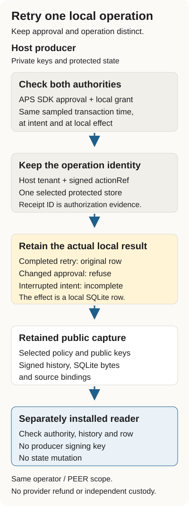

# Approved refund retries: technical reference

Start with the [worked example](../APS-REFUND-RETRIES.md) for the retry story and
the three outcomes. This reference keeps the installation, inspection and refusal
commands together for developers and agents.

An approval receipt can be reissued for the same signed action. Its receipt ID
changes; the action you meant to perform does not. If a host treats each receipt
as a new operation, a retry can record the action twice.

This worked example uses the unchanged APS SDK 7.2.1 to check a synthetic refund
approval. Observer binds the operation to the host tenant and the signed action
reference, then retains its intent and completion in one protected SQLite store.
You will interrupt a process, inspect its retained records and check them with a
separately installed reader. The effect here is a local refund-record row. No
payment provider is called.



## Run the controlled example

Use Linux, Python 3.12, [uv](https://docs.astral.sh/uv/), and Node 20.20.2 or 22.23.3.
Those are the qualified Node patch versions. The initial install needs network
access for the pinned Python and npm dependencies. This remains a source-only
profile, not a published package release.

Start outside any existing checkout. Use a new directory; the recipe refuses an
existing output directory. Each block starts from the directory containing
`aps-refund-demo`. Run the installation block once. The blocks use Bash and stop
on a failed command without closing your interactive shell.

```sh
bash <<'SH'
set -euo pipefail
mkdir aps-refund-demo
cd aps-refund-demo
git clone https://github.com/probityai/agent-evidence-observer.git source
git -C source checkout d00e93c98290edb065a4b73a4f29e9983485fe18
cd source
bash interop/aps-durable-refund-2026-10-05/verify_install.sh ../capture
SH
```

The source pin selects the shipped profile from
[Observer PR #77](https://github.com/probityai/agent-evidence-observer/pull/77).
The recipe builds both wheels, installs separate operator and reader environments,
checks installed source bytes, runs the full core and profile tests, and retains
the native captures and public-reader controls. It also reads every native capture
twice and compares the output bytes. Allow the complete qualification to finish.

The important files are:

| File | What you can inspect |
| --- | --- |
| `capture/native/native-report.json` | Process attempts, local admissions and effects for each capture |
| `capture/native/approval-reissue/attempts.json` | Completion, refused changed approval and retry of the original approval |
| `capture/native/lost-ack/attempts.json` | An interrupted acknowledgement followed by a retry |
| `capture/native/after-intent/attempts.json` | An interrupted intent followed by refused automatic replay |
| Each case's `service.sqlite` | The captured signed state, event history and actual local row |
| Each case's `host-policy.json` | Public keys, selected source/member hashes and the expected local counts |
| `capture/wheel-sha256.txt` and `*-installed-source.json` | The wheel bytes and installed Python source bindings |

The fixed fixture clock tests the declared authorization boundaries. It does not
establish freshness against an outside clock. The producer uses private runtime
files outside the public captures and removes them when the recipe ends.

## Read the retained result from another installation

These commands enter `aps-refund-demo/`, outside the source checkout. The reader
has its own installed wheels and receives public records, not the producer's
signing keys.

For this author-controlled example, compute the fixture policy hash locally. A
deployment consumer must select its policy, keys and hashes through its own
accepted process; hashing an unfamiliar packet does not make it trusted.

```sh
bash <<'SH'
set -euo pipefail
cd aps-refund-demo
profile="$PWD/source/interop/aps-durable-refund-2026-10-05"
capture="$PWD/capture"
node=$(command -v node)
for name in approval-reissue lost-ack after-intent; do
  case_path="$capture/native/$name"
  policy_sha=$(sha256sum "$case_path/host-policy.json" | cut -d' ' -f1)
  "$capture/reader/bin/python" -I -B -m probity_aps_refund.reader \
    "$case_path" --policy-sha256 "$policy_sha" \
    --node "$node" --verifier "$profile/verify-aps.mjs" \
    > "$name-reader.json" 2> "$name-reader.stderr" || {
      status=$?
      cat "$name-reader.stderr" >&2
      exit "$status"
    }
done
"$capture/reader/bin/python" -I -B - <<'PY'
import json
from pathlib import Path
for name in ("approval-reissue", "lost-ack", "after-intent"):
    result = json.loads(Path(name + "-reader.json").read_text())
    print(name, result["logicalAdmissions"], result["localEffects"], result["outcome"])
PY
SH
```

The final three lines are:

```text
approval-reissue 1 1 recorded-local-sqlite-refund-row
lost-ack 1 1 recorded-local-sqlite-refund-row
after-intent 1 0 not-established-after-interruption
```

The complete reader JSON remains in each `*-reader.json` file. A failed read stops
the block before the summary and preserves its `*-reader.stderr` file. The approval-reissue
result also says `same-operation-changed-authorization-refused`: a genuine reissued
approval is not accepted as the original store's frozen authorization. Retrying the
original approval returns its retained completion. A separately approved different
action has a different operation identity and its own capture.

For lost acknowledgement, the local row already committed before the process
stopped. The retry returns that result. For the interrupted intent, the record
does not establish a completed effect, and automatic replay refuses. An accepted
reader result for that case confirms the retained incomplete record; it does not
turn the missing effect into a success.

Counts apply to each capture. The original completion and approval-reissue captures
share one operation; do not add their counts as separate workloads.

## Check a real refusal

Give the reader a policy hash that does not match the retained policy. Save both
output streams, require exit two with the policy-selection refusal, and confirm
that the SQLite bytes stay unchanged.

```sh
bash <<'SH'
set -euo pipefail
cd aps-refund-demo
profile="$PWD/source/interop/aps-durable-refund-2026-10-05"
capture="$PWD/capture"
node=$(command -v node)
case_path="$capture/native/approval-reissue"
before=$(sha256sum "$case_path/service.sqlite" | cut -d' ' -f1)
if "$capture/reader/bin/python" -I -B -m probity_aps_refund.reader \
  "$case_path" \
  --policy-sha256 0000000000000000000000000000000000000000000000000000000000000000 \
  --node "$node" --verifier "$profile/verify-aps.mjs" \
  > wrong-policy.stdout 2> wrong-policy.stderr; then
  echo "unexpected policy acceptance" >&2
  exit 1
else
  status=$?
fi
test "$status" -eq 2
test ! -s wrong-policy.stdout
grep -Fq 'public host policy differs from consumer selection' wrong-policy.stderr
test "$(sha256sum "$case_path/service.sqlite" | cut -d' ' -f1)" = "$before"
cat wrong-policy.stderr
SH
```

The refusal produces no accepted result and does not alter the captured database.
Keep the original policy and all refusal evidence. Do not replace a selected hash
merely to make a consumer accept a changed packet.

## What this establishes

The host checks the genuine SDK decision and its separate local grant at the same
sampled time inside each SQLite transaction. The native profile explicitly selects
UTC milliseconds; finer observations and alternate timestamp spellings refuse.
The public reader checks current authority, retained intent/effect observations,
signed history, selected payload bytes and the actual local row.

This is a controlled process-crash example on one host filesystem. Retaining the
same protected store is part of its boundary. Losing that state or choosing a new
store root does not preserve replay protection. It does not test power loss,
filesystem corruption or distributed failover.

Both installations are operated by the same author. They retain `witnessScope:
PEER` and `independentCustody: false`. Separate processes, wheels and public-key-only
reading do not establish an independent operator, independent custody, delegated
authority, merchant legitimacy, PIC integration or a completed provider refund.

Read the [profile protocol](../../interop/aps-durable-refund-2026-10-05/PROTOCOL.md)
for the exact source, authority and storage contract, and the
[Node 20/22 qualification workflow](../../.github/workflows/aps-durable-refund.yml)
for the complete qualification and retained public artifacts.
